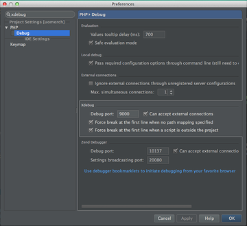

pubstack
========

Publisher's DevStack

## Installation

1. Install [Vagrant](http://www.vagrantup.com/).
1. Install [VirtualBox](https://www.virtualbox.org/).
1. Install Ansible:
    - [Latest Releases Via Homebrew (Mac OSX)](http://docs.ansible.com/intro_installation.html#latest-releases-via-homebrew-mac-osx)
    - [Latest Releases Via Apt (Ubuntu)](http://docs.ansible.com/intro_installation.html#latest-releases-via-apt-ubuntu)
    - [See all](http://docs.ansible.com/intro_installation.html#installing-the-control-machine)
1. Add project files to your machine (for example in `~Sites/www`).
1. Clone this repo:

    ```bash
    git clone git@github.com:NBCUOTS/pubstack.git
    cd pubstack
    ```

1. Install Hostupdater:

    ```bash
    vagrant plugin install vagrant-hostsupdater
    ```

1. Create your config file from the default template and modify as needed (note each config has commented instructions):

    ```bash
    cp default.config.yml config.yml
    vim config.yml
    ```

    **NOTE:** after the initial `vagrant up`, any time you edit your config file values you will want to run `vagrant reload --provision`.

1. Start-up your vagrant box:

    ```bash
    vagrant up
    ```

1. Visit [http://pubstack.dev/](http://pubstack.dev/) in your browser.

## Authors
- breathingrock
- conortm
- ericduran
- scottrigby

## Setting up your IDE for debugging

1. In PhpStorm type `command + comma`. This will open up preference settings.
1. Search for **xdebug** and you should show something similar to the following:

    
    - Make sure `Debug port` is set to `9000`
    - Make sure `can accept external connections` is checked
1. Then in your workspace, click the telephone icon `Start Listen for PHP Debug Connections`

## Customizing

1. Power users can add their own playbook(s):
    - An optional, main user playbook will be loaded if it exists: `provisioning/user.playbook.yml`
    - This playbook can include additional playbooks, including the main playbook, before or after your user-specific roles:

        ```yaml
        ---
        - include: webserver.yml
        ```

2. You can also add custom roles:
    - User-specific roles should follow this naming convention:

        ```bash
        provisioning/roles/user-ROLE-NAME
        ```

**Note:** Both your user playbook, and user-specific roles will be gitignored.

## Troubleshooting

### VPN

- Cisco Issue
    When enabled, the Cisco Anyconnect VPN client blocks out all IP to IP communication.
    The fix is to remove this one line from Mac's IP Firewall, by running this script:

    ```sh
    ./scripts/cisco.workaround.sh
    ```

    You will be prompted for your password. Note you may need to run this twice.
